# Expedition

[Home](../README.md)

Büyük Demirkazık (#2)
==============

-   Elevation: 3,756m
-   Summit Date: July 6, 2025

Büyük Demirkazık, the second-highest summit in the Aladağlar range, is one of Turkey’s most iconic and technical peaks. I had climbed it once before, but the mountain commands so much respect that even a second ascent feels like a fresh challenge. For this expedition, I teamed up with the Summit Turkey group again. On July 5, 2025, I met the team in Çukurbağ village, Niğde. After a hearty breakfast, we loaded our gear onto a tractor and set off toward the Karayalak camping area. We arrived around 2:00 p.m., and setting up my tent turned out to be quite the challenge due to strong winds in the area. Once settled, we held a technical briefing covering gear usage, route plan, anchor points, and rope team coordination. Afterward, I returned to my tent, had dinner, and went to sleep around 9:00 p.m. The next morning started very early—we woke at 12:30 a.m. and began our ascent at 1:45 a.m. via the classical Red Scree (Kızılçarşak) route. By 5:15 a.m., we reached the base of the Red Scree section, and around 8:00 a.m., we arrived at the shoulder of the mountain. After a 30-minute break, we began the technical rock face climb. We summited Büyük Demirkazık at 11:30 a.m., enjoying spectacular views and well-earned rest at the top for about an hour. The descent began with two rope-assisted down-climbs, each approximately 60 meters. We completed the remainder of the rocky descent without rope protection and reached the shoulder again at 4:15 p.m. Following another break, we descended the Red Scree and arrived back at the Karayalak camp around 9:00 p.m. Tired but satisfied, we packed our gear and left the area by 10:00 p.m. After a final dinner stop in Çukurbağ village, I began the drive home around 11:45 p.m. Exhaustion caught up with me midway, so I pulled into a gas station, slept in the car until 6:30 a.m., and continued the drive back home. It was a demanding climb—both technically and physically—but an unforgettable adventure in one of Turkey’s most iconic alpine settings.
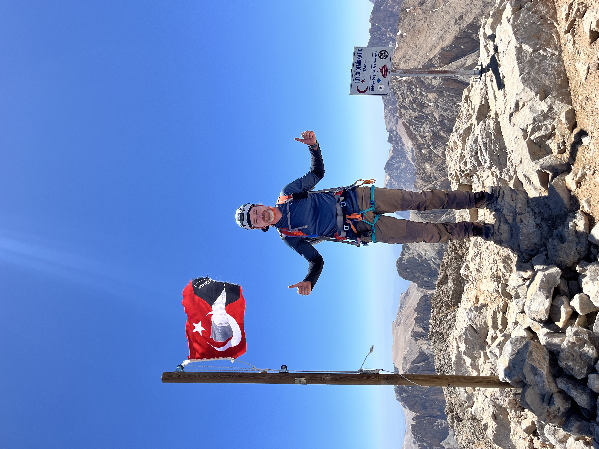
<iframe frameBorder="0" scrolling="no" src="https://www.wikiloc.com/wikiloc/embedv2.do?id=220905642&elevation=on&images=off&maptype=H" width="600" height="500"></iframe>
Powered by&nbsp;<a style="color:#4C8C2B;font-size:11px;line-height:16px;" target="_blank" href="https://www.wikiloc.com">Wikiloc</a>

Mount Hasan (#3)
==============

-   Elevation: 3,268m
-   Summit Date: June 22, 2025

Mount Hasan, an impressive stratovolcano in Türkiye’s Aksaray province, stands as one of the most prominent peaks in Anatolia. On June 21, 2024, I arrived at the mountain’s base—an area near Karbeyaz Hotel that also offers several convenient camping spots. I reached the site around 8:00 p.m., set up my tent, had dinner, and went to bed early, anticipating an early start with the SEDAK hiking group, which was scheduled to arrive around 3:00 a.m.
We began our ascent at 3:40 a.m. via the route known as Yılankar, which is considered a classical yet slightly steeper option than the broader southern approach. The route starts with a moderate incline over scree and transitions into rocky, semi-steep terrain around 2,800 meters. Snow presence was minimal to none, and no technical gear was required. 
By 8:15 a.m., we had reached the so-called "small summit" at 3,256 meters. This is the point where most hikers conclude their climb and consider it the summit of Mount Hasan. However, across the crater lies the mountain’s true summit, slightly higher at 3,268 meters.
While the group took a one-hour break at the small summit, I seized the opportunity to solo traverse the crater and reach the true summit on the opposite side. I returned around 9:40 a.m., rejoined the group, and we began our descent shortly after at 9:50 a.m. We arrived back at the campsite around 1:30 p.m.
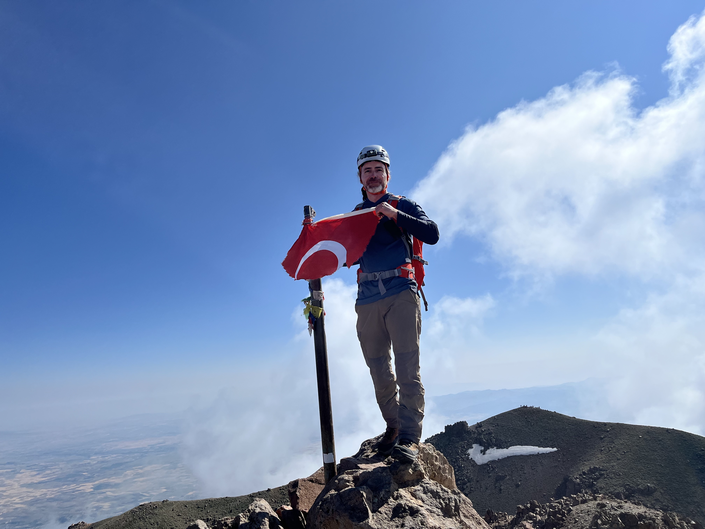
<iframe frameBorder="0" scrolling="no" src="https://www.wikiloc.com/wikiloc/embedv2.do?id=219069738&elevation=on&images=off&maptype=H" width="600" height="500"></iframe>
Powered by&nbsp;<a style="color:#4C8C2B;font-size:11px;line-height:16px;" target="_blank" href="https://www.wikiloc.com">Wikiloc</a>

Pilot Tepe
==============

-   Elevation: 2,973m
-   Summit Date: June 14, 2025

Located in the beautiful Niğde Province of Türkiye, Pilot Tepe had been on my list for a while. On June 14, 2025, I set out with my family and we arrived at the Meydan Plateau around 11:30 a.m. We hadn’t fully decided whether we’d camp or not—and if we did, whether it would be at the plateau or by Karagöl. So we chose to hike up to Karagöl first, leaving our camping gear behind just in case. About 1.5 kilometers later, we arrived at Karagöl. The view was stunning—wildflowers blooming around the lake, with the mountains still wearing traces of snow. After setting up a small shade tent for my family, I went on a solo hike to Çiniligöl and then continued up to the summit of Pilot Tepe. I reached the top around 2:45 p.m. and spent about 45 minutes soaking in the incredible views of both Karagöl and Çiniligöl. Once I returned, we all agreed to camp by Karagöl. I made a quick round trip back to the Meydan Plateau to grab our gear and managed to set up camp just before nightfall. The next morning, I woke up early around 5 a.m. and took a quiet walk around Karagöl. After breakfast, we did a family hike to Çiniligöl. Later in the day, I carried some of our gear back to the car, returned for the rest, and after a relaxed lunch in our tent, we packed up and headed home—tired, happy, and already thinking about the next adventure.
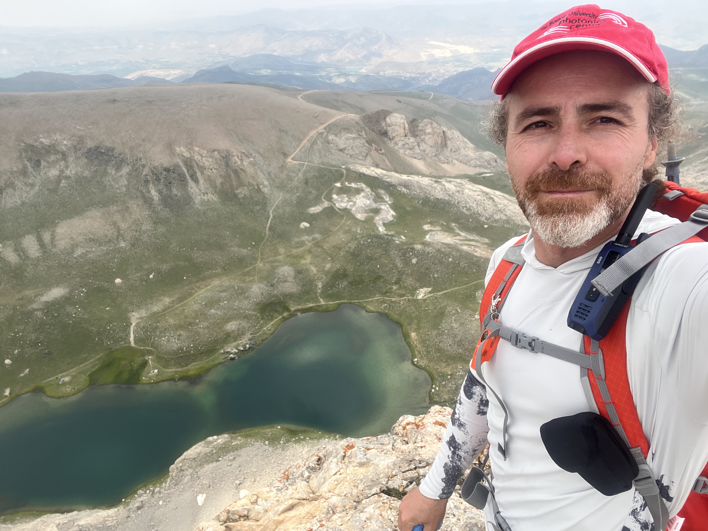
<iframe frameBorder="0" scrolling="no" src="https://www.wikiloc.com/wikiloc/embedv2.do?id=218076862&elevation=on&images=off&maptype=H" width="600" height="500"></iframe>
Powered by&nbsp;<a style="color:#4C8C2B;font-size:11px;line-height:16px;" target="_blank" href="https://www.wikiloc.com">Wikiloc</a>

Mount Dedegöl (#3)
==============

-   Elevation: 2,998m
-   Summit Date: May 25, 2025

Mount Dedegöl, the highest peak in the Central Taurus Mountains, is located in Isparta Province, Türkiye. On May 24, 2025, I arrived at the Melikler Plateau around 5:30 p.m. and set up my camp. The next morning, I woke at 3:30 a.m. and began the ascent at 4:00 a.m. After a steady climb, we reached the summit at 7:45 a.m., where we paused to take in the breathtaking views. We began our descent at 8:45 a.m. and returned to camp around 11:00 a.m. After a brief rest in my tent, I packed up and headed to the nearby Yaka Canyon. I decided to attempt a solo passage through it. I trekked about 4.5 kilometers into the canyon and encountered two snakes resting on a rock directly in my path. I observed them for a while, took some photos and videos, then decided to turn back. Interestingly, the information board at the canyon entrance stated the total length as 4 kilometers. However, even after hiking 4.5 kilometers, the canyon continued. It seems that the 4 km distance likely refers not to the trail starting at the entrance, but to the narrower, more enclosed section of the canyon, which begins approximately 2 kilometers in.
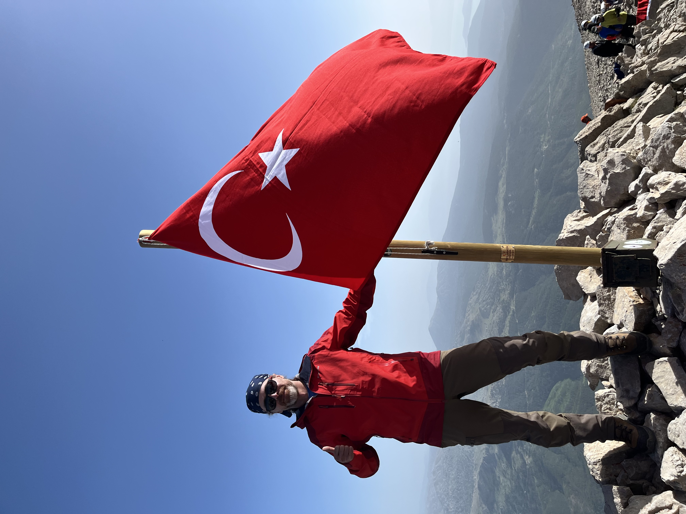
<iframe frameBorder="0" scrolling="no" src="https://www.wikiloc.com/wikiloc/embedv2.do?id=215156117&elevation=on&images=off&maptype=H" width="600" height="500"></iframe>
Powered by&nbsp;<a style="color:#4C8C2B;font-size:11px;line-height:16px;" target="_blank" href="https://www.wikiloc.com">Wikiloc</a>

Mount Dedegöl (#2)
==============

-   Elevation: 2,998m
-   Summit Date: April 20, 2025

Mount Dedegöl is the highest peak in the Central Taurus Mountains, located in Isparta province, Türkiye. On April 19, 2025, I arrived at Melikler Plateau around noon with my family and set up our camp. This climb wasn’t pre-planned, but I had the intention to summit if the conditions allowed. Coincidentally, the Anadolu Dağcılık club was also camping in the area, and I asked if I could join their climb. I woke up at 3:30 a.m. and began the ascent at 4:15 a.m. After a steady climb, we started using ice axes and crampons about 300 meters below the summit. We reached the top at 10:00 a.m., took a break to enjoy the breathtaking views, and began our descent at 11:00 a.m. I arrived back at camp around 1:00 p.m.
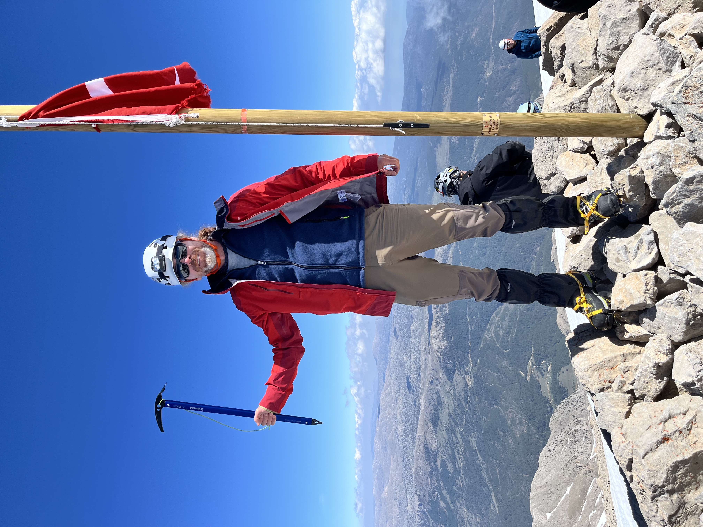
<iframe frameBorder="0" scrolling="no" src="https://www.wikiloc.com/wikiloc/embedv2.do?id=209896323&elevation=on&images=off&maptype=H" width="600" height="500"></iframe>
Powered by&nbsp;<a style="color:#4C8C2B;font-size:11px;line-height:16px;" target="_blank" href="https://www.wikiloc.com">Wikiloc</a>

Mount Kızlar Sivrisi
==============

-   Elevation: 3,070m
-   Summit Date: March 23, 2025

Kızlar Sivrisi, the highest peak in the Bey Dağları mountain range, is part of the western Taurus Mountains. For this climb, I joined the Summit Turkey club from Istanbul. On March 21, 2025, I arrived in Elmalı, Antalya, around 11 p.m. and checked into Akça Hotel for the night. The next morning, I met up with the rest of the group, and we set off for Büyüksöyle Village. From there, we loaded our gear onto a tractor, which transported it as close to the base camp as possible. The final stretch required a 1 km hike with all our equipment. At the camping area, there was a chalet where most of the group stayed, but I opted to set up my own tent. We spent some time practicing crampon and ice axe techniques in preparation for the ascent. After dinner in my tent at 7:00 p.m., I went to bed early at 9:00 p.m. The summit push began early the next morning. We woke up at 2:30 a.m. and started our ascent at 3:45 a.m.. After a steady climb, we reached the summit at 11:00 a.m., took a short break to enjoy the breathtaking views, and began our descent at 11:30 a.m.. We arrived back at camp around 3:00 p.m. and eventually returned to Elmalı by 7:30 p.m. Exhausted from the climb and facing a six-hour drive home, I decided to spend another night at Akça Hotel to rest before making the journey back.
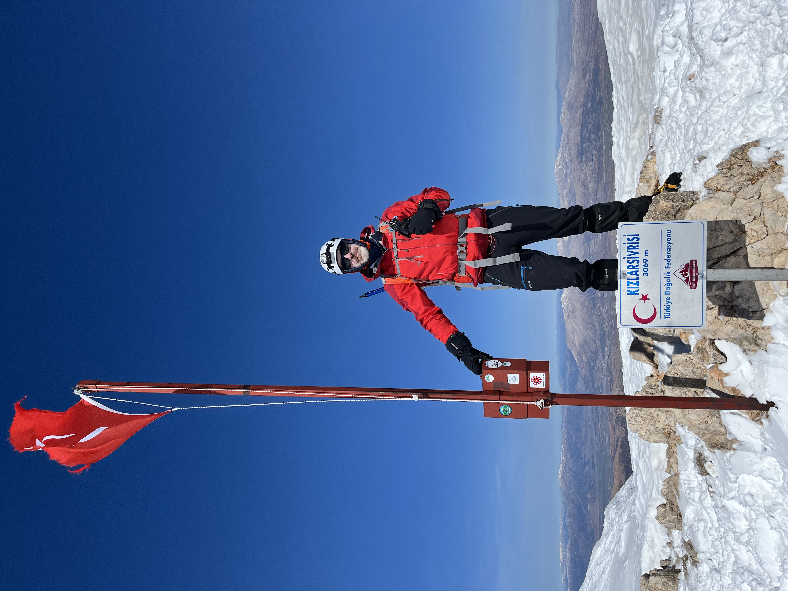
<iframe frameBorder="0" scrolling="no" src="https://www.wikiloc.com/wikiloc/embedv2.do?id=205866607&elevation=on&images=off&maptype=H" width="600" height="500"></iframe>
Powered by&nbsp;<a style="color:#4C8C2B;font-size:11px;line-height:16px;" target="_blank" href="https://www.wikiloc.com">Wikiloc</a>

Mount Erciyes (#2)
==============

-   Elevation: 3,917m
-   Summit Date: March 2, 2025

Mount Erciyes, an inactive volcano in Kayseri province, Türkiye, is the highest mountain and volcano in Central Anatolia and the fifth highest peak in the country. This was my second attempt to summit Erciyes, and my first winter ascent, with the Summit Turkey club from Istanbul. On March 1, 2025, I arrived at Erciyes Ski Resort around 10:30 a.m. and met up with the group. We took the first cable car to a café at the top of the hill, and the ski resort activated the second cable car for us, bringing us close to our camping area. We set up camp around 2:30 p.m. and spent some time practicing crampon and ice axe techniques. After having dinner in my tent at 6:30 p.m., I went to bed by 7:30 p.m. We woke up at 3:00 a.m. and started our ascent at 4:15 a.m. After a steady climb, we reached the summit at 11:20 a.m. and began our descent at noon. We returned to camp around 2:00 p.m. On the way back, the ski resort did not activate the second cable car, so we had to hike down with all our gear, including camping equipment. We finally reached the ski resort around 4:00 p.m.

<iframe frameBorder="0" scrolling="no" src="https://www.wikiloc.com/wikiloc/embedv2.do?id=203491398&elevation=on&images=off&maptype=H" width="600" height="500"></iframe>
Powered by&nbsp;<a style="color:#4C8C2B;font-size:11px;line-height:16px;" target="_blank" href="https://www.wikiloc.com">Wikiloc</a>

Emler (#2)
==============

-   Elevation: 3,723m
-   Date: January 26, 2025

Emler is the fourth-highest peak in the Aladağlar mountain range, part of the Taurus Mountains. I attempted to summit this mountain for the second time, this time in winter, with the Summit Turkey club from Istanbul. On January 25, 2025, I arrived in Çukurbağ village, Niğde, around 10 a.m., where I met up with the rest of the group. After a shared breakfast, we loaded our gear onto a tractor, which took us to the Sokullupınar camping area. We set up camp and then hiked up to the Karayalak camping area for acclimatization. After dinner in our tents, we went to bed early, aiming to wake up around 11:30 p.m. Our hike began at 12:15 a.m., and thanks to the snow tracks from the previous day, we reached the Karayalak camping area in less than an hour. By around 6 a.m., we reached the point known as "Kapı" (Door). This is often considered the real starting point of the climb, but by this time, we were already significantly behind schedule. The challenging snow conditions made the hike much more difficult than anticipated. Before continuing on to the steep section beyond "Kapı," we conducted an avalanche risk assessment. The test indicated a potential risk, especially higher up, near a pass. Considering the avalanche threat and the fact that we were already behind schedule—making the summit unfeasible even if we had continued—we decided to prioritize safety and turn back.

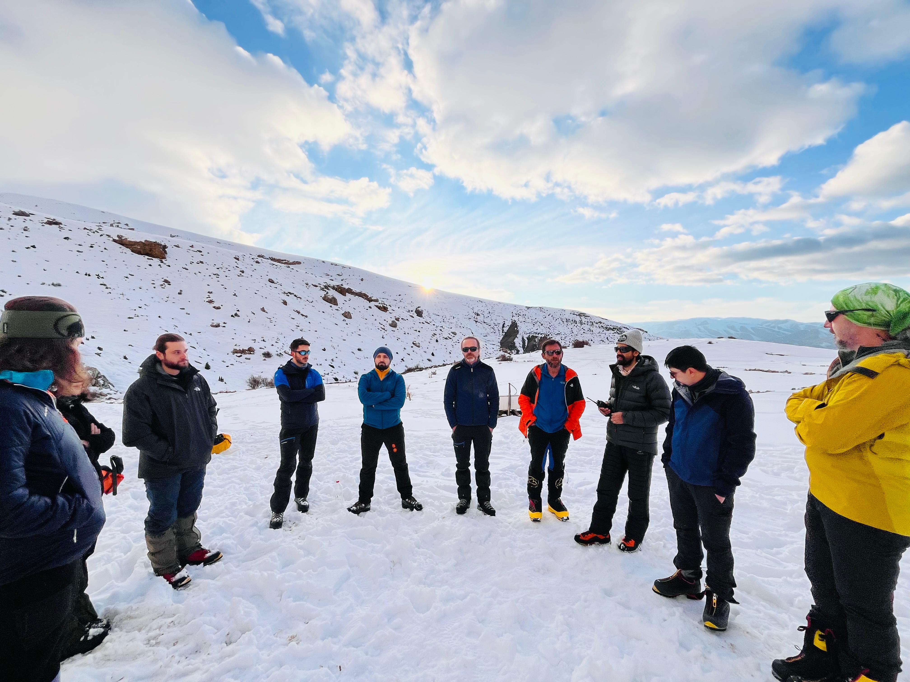
<iframe frameBorder="0" scrolling="no" src="https://www.wikiloc.com/wikiloc/embedv2.do?id=199288867&elevation=on&images=off&maptype=H" width="600" height="500"></iframe>
Powered by&nbsp;<a style="color:#4C8C2B;font-size:11px;line-height:16px;" target="_blank" href="https://www.wikiloc.com">Wikiloc</a>

Mount Hasan (#2)
==============

-   Elevation: 3,268m
-   Summit Date: December 1, 2024

Mount Hasan, a volcano located in Aksaray province, Türkiye, is one of the most prominent peaks in Anatolia. This climb marked my second ascent of the mountain and my first experience with winter climbing. For this adventure, I joined a club called Alpin Dağcılık. On November 30, 2024, I arrived at the mountain’s base near Karbeyaz Hotel, the typical starting point for hikes, at around 1:30 p.m. and set up camp. We began our hike at 3:15 a.m., following the classical route. Snow from a recent snowfall a week prior covered the mountain, and as the first climbers since the snowfall, there were no visible tracks to follow. Fortunately, the weather was mild enough that we didn’t require technical equipment like ice axes or crampons. After a steady ascent, we reached the summit at approximately 10:45 a.m., taking about 7 hours and 30 minutes from base to summit. We spent around 30 minutes at the summit, enjoying the views, before starting our descent. Aware of the potential for freezing temperatures later in the day, we aimed to return to camp quickly. The descent was smooth and efficient, taking just 2 hours and 15 minutes. We arrived back at our camp at 1:30 p.m., completing a memorable and successful climb.
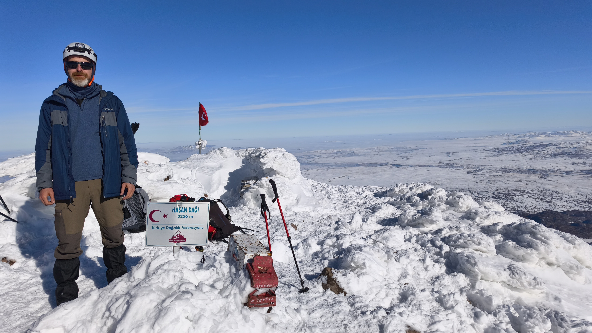
<iframe frameBorder="0" scrolling="no" src="https://www.wikiloc.com/wikiloc/embedv2.do?id=193507382&elevation=on&images=off&maptype=H" width="600" height="500"></iframe>
Powered by&nbsp;<a style="color:#4C8C2B;font-size:11px;line-height:16px;" target="_blank" href="https://www.wikiloc.com">Wikiloc</a>

Büyük Demirkazık (#1)
==============

-   Elevation: 3,756m
-   Summit Date: October 28, 2024

Büyük Demirkazık is a peak in the Aladağlar mountain range and the second highest summit in the range, after Kızılkaya. This climb was part of a 4-day, 3-night expedition that aimed to summit three peaks: Küçük Demirkazık, Büyük Demirkazık, and Davlumbaz. For this trip, I joined a group called Summit Turkey. On October 26, 2024, I met the group in Çukurbağ village, Niğde. After breakfast, we loaded our gear onto a tractor and traveled to Arpalık Plateau, where four horses were waiting to carry our equipment to the Obayeri camping area.
Büyük Demirkazık was the second summit of our expedition, following Küçük Demirkazık. We woke up around 5:30 a.m. and began hiking around 6:20 a.m., taking the classic route. We reached the shoulder via the East Scree and stopped for breakfast before starting the technical climb up the rock face. We reached the summit around 2:00 p.m. After spending about 30 minutes on the summit, we began our descent right away.
After two rope-protected down-climbs, the sun set and it grew dark. We continued with several more technical descents, all in the dark. By 12:30 a.m., we reached the shoulder, but there was still a long way to go, and it was cold and dark. The East Scree route was too dangerous to navigate in the dark, so we decided to take the Red Scree route to reach the Karayalak camping area, where transportation had been arranged to take us back to Çukurbağ village.
We finished descending the Red Scree around 2:30 a.m. and started hiking through the valley. Around 4:30 a.m., we encountered a dangerous snowy section of the valley that was risky to cross in the dark. We decided to find shelter and wait for dawn. After sunrise, we crossed the snowy area safely and reached the Karayalak camping area around 11:00 a.m. on October 29, 2024.
The recorded trail below ends at the snowy section where we got stuck, as my phone battery died while we waited for dawn. As a result, approximately 8 km of the trail leading to the Karayalak camping area is missing.

<iframe frameBorder="0" scrolling="no" src="https://www.wikiloc.com/wikiloc/embedv2.do?id=189906915&elevation=on&images=off&maptype=H" width="600" height="500"></iframe>
Powered by&nbsp;<a style="color:#4C8C2B;font-size:11px;line-height:16px;" target="_blank" href="https://www.wikiloc.com">Wikiloc</a>

Küçük Demirkazık
==============

-   Elevation: 3,456m
-   Date: October 27, 2024

Küçük Demirkazık is a peak in the Aladağlar mountain range. This climb was part of a 4-day, 3-night expedition that aimed to summit three peaks: Küçük Demirkazık, Büyük Demirkazık, and Davlumbaz. For this adventure, I joined a group called Summit Turkey. On October 26, 2024, I met the group in Çukurbağ village, Niğde. After breakfast, we loaded our gear onto a tractor and traveled to Arpalık Plateau, where four horses were waiting to carry our equipment to Obayeri camping area. We arrived just before sunset and quickly set up camp before it got dark. It was extremely cold, and I only managed to get some partial rest during the night due to the low temperatures.
We woke up around 5:30 a.m., prepared for the day, and left at 6:00 a.m. for our first summit, Küçük Demirkazık. This climb requires technical climbing experience, which I did not have, and it is known as one of the most challenging technical ascents in the region. We reached 3,300 meters elevation around 10:00 a.m. By this point, the climb had not been very technical, but the remaining ascent was much more difficult and required setting up ropes. Our guide, Emre Varol, climbed first and set the ropes along the route. However, after completing the first pitch, he suggested that I refrain from continuing due to the partial snow cover on the pitch and loose rocks. I agreed, recognizing that it wasn’t a safe climb without prior experience.
I waited at that point while the rest of the group continued to the summit and then returned. We descended back to camp, arriving around 8:00 p.m. after sunset. After a quick dinner, we went to sleep to rest for the next summit the following day. Fortunately, the weather was warmer than the previous night, allowing me to sleep much better.
I was only able to record the trail one way because my phone battery died.
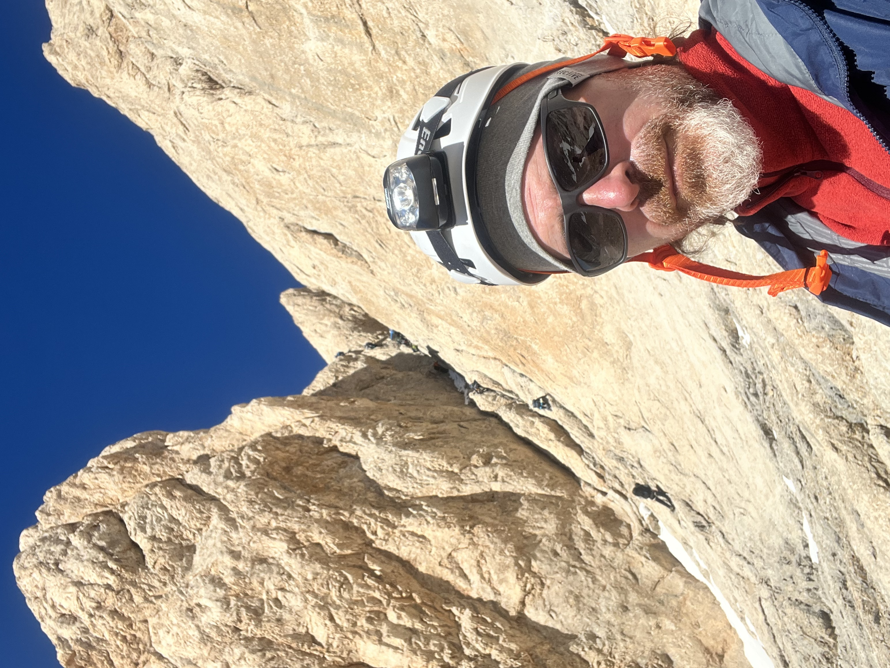
<iframe frameBorder="0" scrolling="no" src="https://www.wikiloc.com/wikiloc/embedv2.do?id=189811174&elevation=on&images=off&maptype=H" width="600" height="500"></iframe>
Powered by&nbsp;<a style="color:#4C8C2B;font-size:11px;line-height:16px;" target="_blank" href="https://www.wikiloc.com">Wikiloc</a>

Mount Erciyes
==============

-   Elevation: 3,917m
-   Summit Date: August 18, 2024

Mount Erciyes is an inactive volcano located in Kayseri province, Türkiye. It is the highest mountain and volcano in Central Anatolia and the fifth highest peak in Türkiye. I climbed this mountain with the SEDAK club from Konya province. We departed from Konya early in the morning on August 17, 2024, and arrived at the Erciyes Ski Resort in the afternoon. We took the cable car up to the café at the top of the hill, and from there, we hiked about 2 km with all of our gear, including our camping equipment. We set up camp around 5 p.m., enjoyed dinner, and went to bed. We woke up at around 1:30 a.m. and began hiking at 2:00 a.m. After a steady ascent, we reached the summit around 8:00 a.m., had breakfast, and began our descent at 9:20 a.m. We returned to camp around 1:00 p.m.
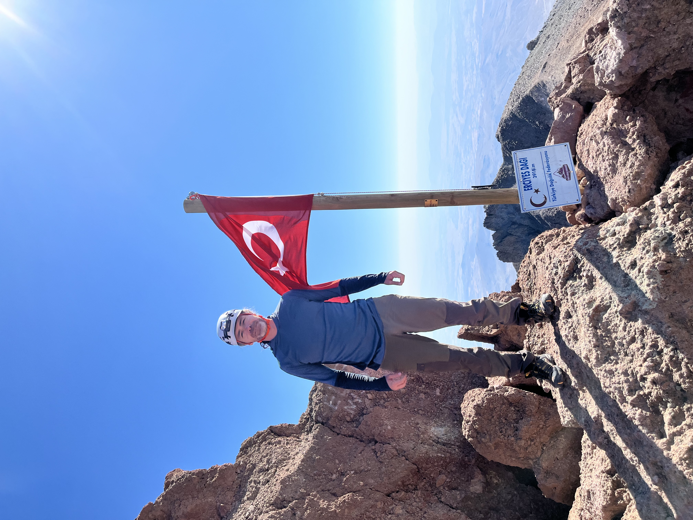
<iframe frameBorder="0" scrolling="no" src="https://www.wikiloc.com/wikiloc/embedv2.do?id=181529944&elevation=on&images=off&maptype=H" width="600" height="500"></iframe>
Powered by&nbsp;<a style="color:#4C8C2B;font-size:11px;line-height:16px;" target="_blank" href="https://www.wikiloc.com">Wikiloc</a>

Emler (#1)
==============

-   Elevation: 3,723m
-   Summit Date: July 21, 2024

Emler is the fourth highest peak in the Aladağlar mountain range, which is part of the Taurus Mountains. I climbed this mountain with the MEDIDAK club from Mersin. I arrived in Çamardı, a town in Niğde, around noon on July 20, 2024, where I met up with the rest of the group. After having lunch and stocking up on supplies from the local stores, we headed to the Turkish Mountaineering Federation (TDF) training center. From there, we transferred to a tractor that took us to the Karayalak camping area, where we set up camp. After a shared dinner, we went to sleep.
We woke up around 1:30 a.m. and started our hike at 2:00 a.m. By the time we reached Dinlenme Taşı (Rest Stone), dawn had just broken, and the temperature was very cold. Not wanting to stay still too long as my sweat was chilling me and I didn’t have extra layers, I informed the others and decided to continue ahead. I reached the summit around 9:00 a.m., with the rest of the group arriving about an hour later. The view from the summit was breathtaking, with all the peaks of the Aladağlar range visible.
After spending about an hour on the summit (I stayed for two hours since I had arrived earlier), we had breakfast, took photos, and soaked in the surroundings. We then descended back to the Karayalak camping area, where I arrived at around 3:00 p.m.
The Emler hike demands strong physical endurance and acclimatization to altitude, but no technical climbing skills are required.

<iframe frameBorder="0" scrolling="no" src="https://www.wikiloc.com/wikiloc/embedv2.do?id=178126944&elevation=on&images=off&maptype=H" width="600" height="500"></iframe>
Powered by&nbsp;<a style="color:#4C8C2B;font-size:11px;line-height:16px;" target="_blank" href="https://www.wikiloc.com">Wikiloc</a>

Mount Aydos
==============

-   Elevation: 3,425m
-   Summit Date: June 30, 2024

Mount Aydos, the highest peak in Konya province and the second highest in the Bolkar mountain range (part of the Taurus range), is a prominent climbing destination in Türkiye. I joined a mountaineering group (SEDAK) for this climb, who planned to arrive early in the morning at around 2 a.m. and begin the hike immediately. I decided to arrive earlier to set up camp and rest before the climb.
On June 29, 2024, I reached Çakıllar village at around 7 p.m. Beyond the village, there’s an 8-kilometer gravel road leading to the trail base. After driving about 4 kilometers on this road, my car started experiencing issues. I decided to return to Çakıllar village to meet the group and travel with them to the trail base. Instead of setting up camp, I rested in my car while waiting for the group, who arrived at around 1:30 a.m. We reached the trail base together at approximately 2 a.m.
We started hiking immediately, following what is known as the ERDAK Club Route, though with some modifications. By 10 a.m., we reached the summit, where we were treated to breathtaking views of Mount Hasan, Mount Erciyes, Demirkazık, and Medetsiz in the distance. We spent about an hour and a half enjoying the scenery before starting our descent. We returned to the trail base at approximately 2:30 p.m.

<iframe frameBorder="0" scrolling="no" src="https://www.wikiloc.com/wikiloc/embedv2.do?id=175810091&elevation=on&images=off&maptype=H" width="600" height="500"></iframe>
Powered by&nbsp;<a style="color:#4C8C2B;font-size:11px;line-height:16px;" target="_blank" href="https://www.wikiloc.com">Wikiloc</a>

Mount Hasan (#1)
==============

-   Elevation: 3,268m
-   Summit Date: June 9, 2024

Mount Hasan, a volcano located in Aksaray province, Türkiye, is a prominent peak in Anatolia. On June 8, 2024, I reached the mountain's base, where most hikes typically begin. This area features a hotel named Karbeyaz and several camping spots. I arrived at around 9 p.m., set up my camp, and went to sleep early, as I planned to join a hiking group (SEDAK) that was scheduled to arrive at 2 a.m. and start the hike immediately.
We began the hike between 2:30 and 3 a.m., initially following the classical route. However, just below a rock structure called Damlataş, we deviated from the usual trail that winds through scree and instead ascended directly. This route was slightly precarious due to patches of snow and loose rocks.
We reached the summit between 9 and 10 a.m., taking in the breathtaking views. For the descent, we followed the classical route and arrived back at the camp at around 3 p.m.

<iframe frameBorder="0" scrolling="no" src="https://www.wikiloc.com/wikiloc/embedv2.do?id=173603435&elevation=on&images=off&maptype=H" width="600" height="500"></iframe>
Powered by&nbsp;<a style="color:#4C8C2B;font-size:11px;line-height:16px;" target="_blank" href="https://www.wikiloc.com">Wikiloc</a>

Mount Özyurt (Hacıbaba)
==============

-   Elevation: 2,481m
-   Summit Date: January 6, 2024

Özyurt Mountain (also known as Hacıbaba) is the highest peak in Karaman province, Türkiye. Before my successful climb, I made two prior attempts, both of which were unsuccessful.
The first attempt was on October 28, 2023, but I had to abandon the hike due to a family emergency. The second attempt took place on November 11, 2023. We began the hike around noon, but as we approached the summit, it became clear that it would get dark before we could complete the climb. Reluctantly, we decided to turn back approximately 500 meters below the summit.
On January 6, 2024, I decided to make a third attempt, this time solo. I successfully reached the summit at around 3:30 p.m. Unfortunately, it got dark half way down and I was descending along a different trail down than the one I had taken up. While the trail wasn’t technical, it was rocky, and my physical fitness wasn’t adequate for such a challenging hike. By the time I finished, my legs were trembling, I struggled to sit for several days, and my toes were covered in blisters.
Although the elevation of Özyurt Mountain isn’t particularly high and the climb isn’t technical, it does demand a good level of physical fitness—especially for the route I chose. That said, there are alternative, easier trails available for summiting this peak.
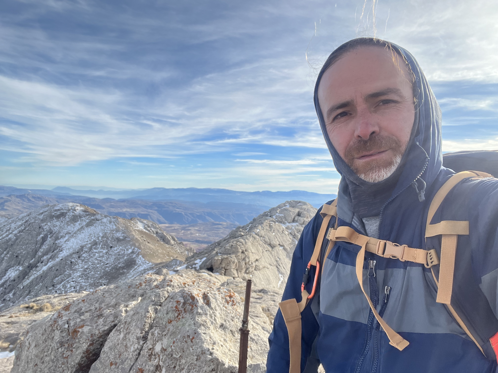
<iframe frameBorder="0" scrolling="no" src="https://www.wikiloc.com/wikiloc/embedv2.do?id=157526178&elevation=on&images=off&maptype=H" width="600" height="500"></iframe>
Powered by&nbsp;<a style="color:#4C8C2B;font-size:11px;line-height:16px;" target="_blank" href="https://www.wikiloc.com">Wikiloc</a>

Mount Dedegöl (#1)
==============

-   Elevation: 2,998m
-   Summit Date: August 31, 2019

Mount Dedegöl is the highest peak in the Central Taurus mountain range, located in Isparta province, Türkiye. Originally, I planned to summit the peak solo, but at the last moment, I decided to bring my nephew along.
This was my first attempt at climbing a mountain of this height. Although it didn’t require technical climbing skills, I underestimated the challenge, believing we could complete the climb with ease. Unfortunately, we made a critical mistake right from the start: we didn't carry enough water.
We began our ascent around 9 a.m. and reached the summit by approximately 1 p.m., but we had already run out of water on the way up. On the descent, we made another poor decision to go off-trail, hoping to find water. However, the terrain became increasingly difficult and led us farther from our base camp at Melikler Plateau. On top of that, we couldn’t locate any water sources.
Thankfully, we encountered a shepherd family who generously provided us with water and tea. They also had guests with an off-road truck who were kind enough to offer us a ride back to our base camp.
In the picture below, Melikler Plateau is visible in the far distance to the left of my right hand. In the trail I recorded below, the last 7 kilometers of the trail were recorded during the off-road truck ride back.
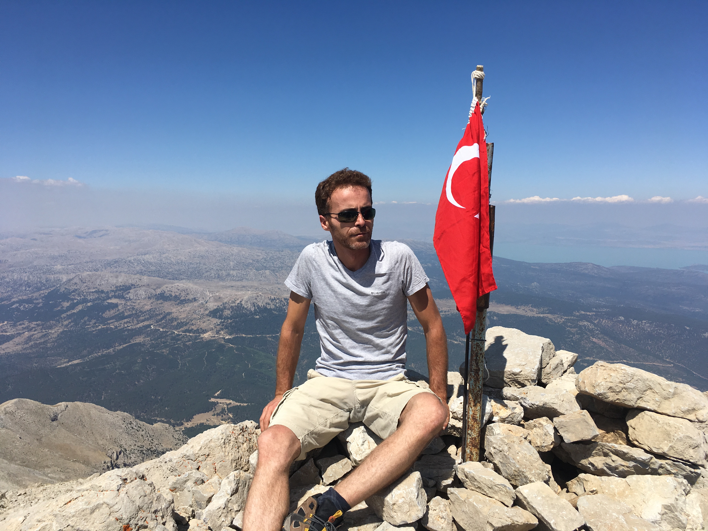
<iframe frameBorder="0" scrolling="no" src="https://www.wikiloc.com/wikiloc/embedv2.do?id=167076774&elevation=on&images=off&maptype=H" width="600" height="500"></iframe>
Powered by&nbsp;<a style="color:#4C8C2B;font-size:11px;line-height:16px;" target="_blank" href="https://www.wikiloc.com">Wikiloc</a>

