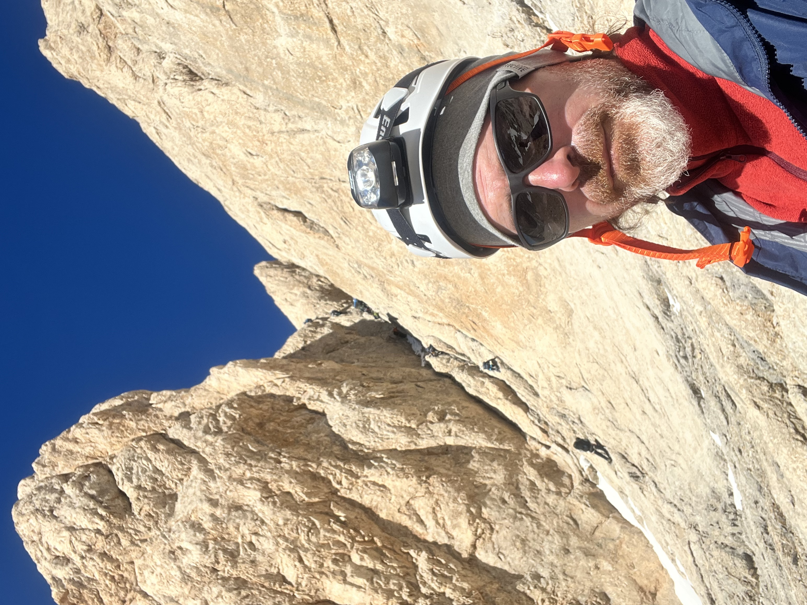
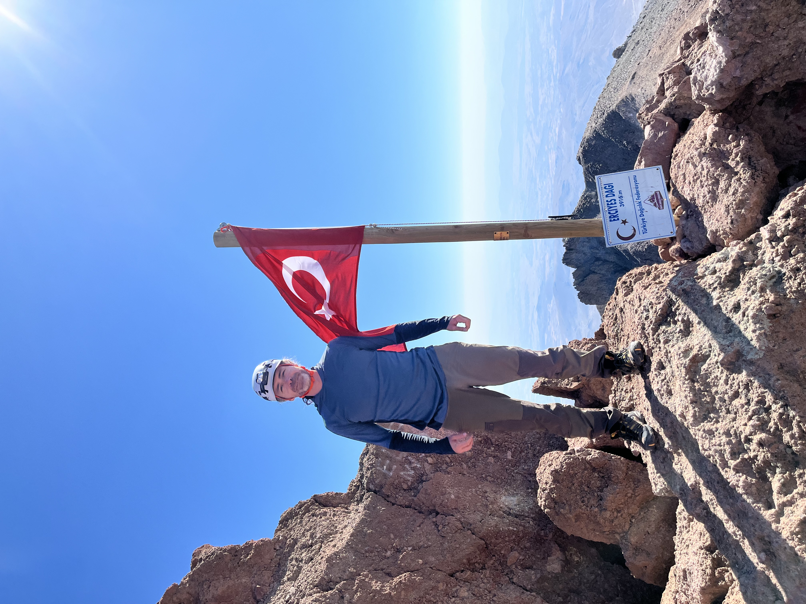
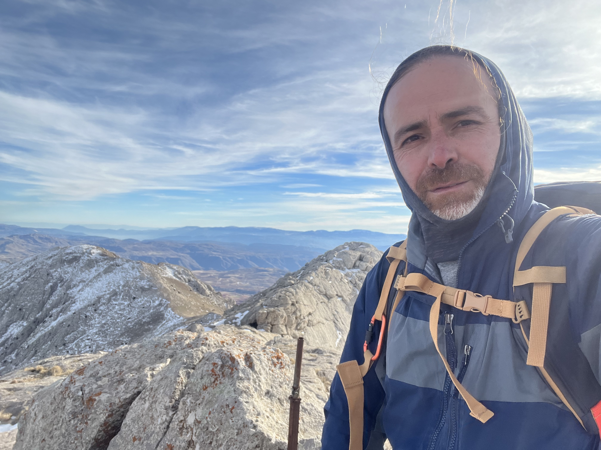
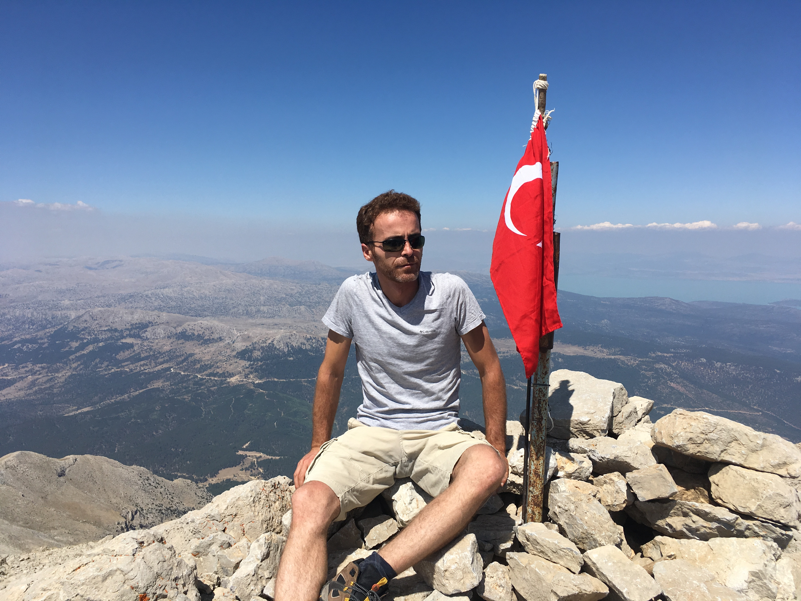

# Outdoor

[Home](../README.md)

Büyük Demirkazık
==============

-   Elevation: 3.756m
-   Summit Date: October 28, 2024

Aladağlar Büyük Demirkazık is. 

<iframe frameBorder="0" scrolling="no" src="https://www.wikiloc.com/wikiloc/embedv2.do?id=189906915&elevation=on&images=off&maptype=H" width="600" height="500"></iframe>
Powered by&nbsp;<a style="color:#4C8C2B;font-size:11px;line-height:16px;" target="_blank" href="https://www.wikiloc.com">Wikiloc</a>

Küçük Demirkazık
==============

-   Elevation: 3.456m
-   Summit Date: October 27, 2024

Aladağlar Küçük Demirkazık is. 

<iframe frameBorder="0" scrolling="no" src="https://www.wikiloc.com/wikiloc/embedv2.do?id=189811174&elevation=on&images=off&maptype=H" width="600" height="500"></iframe>
Powered by&nbsp;<a style="color:#4C8C2B;font-size:11px;line-height:16px;" target="_blank" href="https://www.wikiloc.com">Wikiloc</a>

Mount Erciyes
==============

-   Elevation: 3.917m
-   Summit Date: August 18, 2024

Mount Erciyes is. 

<iframe frameBorder="0" scrolling="no" src="https://www.wikiloc.com/wikiloc/embedv2.do?id=181529944&elevation=on&images=off&maptype=H" width="600" height="500"></iframe>
Powered by&nbsp;<a style="color:#4C8C2B;font-size:11px;line-height:16px;" target="_blank" href="https://www.wikiloc.com">Wikiloc</a>

Emler
==============

-   Elevation: 3.723m
-   Summit Date: July 21, 2024

Aladağlar Emler is. 

<iframe frameBorder="0" scrolling="no" src="https://www.wikiloc.com/wikiloc/embedv2.do?id=178126944&elevation=on&images=off&maptype=H" width="600" height="500"></iframe>
Powered by&nbsp;<a style="color:#4C8C2B;font-size:11px;line-height:16px;" target="_blank" href="https://www.wikiloc.com">Wikiloc</a>

Mount Aydos
==============

-   Elevation: 3.425m
-   Summit Date: June 30, 2024

Mount Aydos is. 

<iframe frameBorder="0" scrolling="no" src="https://www.wikiloc.com/wikiloc/embedv2.do?id=175810091&elevation=on&images=off&maptype=H" width="600" height="500"></iframe>
Powered by&nbsp;<a style="color:#4C8C2B;font-size:11px;line-height:16px;" target="_blank" href="https://www.wikiloc.com">Wikiloc</a>

Mount Hasan
==============

-   Elevation: 3.268m
-   Summit Date: June 9, 2024

Mount Hasan is. 

<iframe frameBorder="0" scrolling="no" src="https://www.wikiloc.com/wikiloc/embedv2.do?id=173603435&elevation=on&images=off&maptype=H" width="600" height="500"></iframe>
Powered by&nbsp;<a style="color:#4C8C2B;font-size:11px;line-height:16px;" target="_blank" href="https://www.wikiloc.com">Wikiloc</a>

Mount Özyurt (Hacıbaba)
==============

-   Elevation: 2.481m
-   Summit Date: January 6, 2024

Özyurt (aka Hacıbaba) mountain is the highest peak in Karaman province of Türkiye. I tried two unsuccessful climb attempts to this mountain prior to this. The first one was on October 28, 2023 and I had to give up the hike because of a family urgecy that I had to take care of. The second one was on November 11, 2023. We started the hike around noon and unfortunately it was getting late and it was going to get dark when we reach the summit. Therefore, we decided to return around 500 meters below the summit. On January 6, 2024 I decided to try this climb again solo. I was able to reach the summit around 3:30pm. It unfortunately got dark half way down and I was taking a different trail down. The down trail wasn't technical, but rocky and my physical fitness wasn't good enough for this kind of hike. My legs were literally shaking when I finished, had difficult sitting down for a few days, and my toes had blisters all over. Eventhough the elevation of this mountain is not too high and it is not a technical mountain, it certainly requires good physical fitness. This is at least true for the trail I took, but there are also easier trails to summit this peak.

<iframe frameBorder="0" scrolling="no" src="https://www.wikiloc.com/wikiloc/embedv2.do?id=157526178&elevation=on&images=off&maptype=H" width="600" height="500"></iframe>
Powered by&nbsp;<a style="color:#4C8C2B;font-size:11px;line-height:16px;" target="_blank" href="https://www.wikiloc.com">Wikiloc</a>

Mount Dedegöl
==============

-   Elevation: 2.998m
-   Summit Date: August 31, 2019

Mount Dedegöl is the  highest peak in the Central Taurus mountains, located in Isparta province in Türkiye.
I was originally planning to solo summit this peak, but at the last moment I took my nephew with me.
This was going to be my first climb of a mountain this high, but still I thought we could make this climb easily as it didn't require any technical skill.
This was a mistake from the beginning as we didn't take enough water with us.
We started around 9am and reached the summit at around 1pm. However, we had already run out of water on the way up.
Then we made the second mistake and went off-trail in the hopes that we find water on the way down.
The off-trail became very difficult, went away from our camp as we descended, and didn't find any water. 
We were however lucky to run into a shepherd family who provided us water.
They also had some guests with offroad truck, who were going to pass by our base camp in Melikler Plateau and were happy to give us a lift.
In the trail that I recorded below, Melikler Plateau can be seen at the far distance to left of my right hand. The last 7 kilometers of the trail was recorded on the offroad truck.

<iframe frameBorder="0" scrolling="no" src="https://www.wikiloc.com/wikiloc/embedv2.do?id=167076774&elevation=on&images=off&maptype=H" width="600" height="500"></iframe>
Powered by&nbsp;<a style="color:#4C8C2B;font-size:11px;line-height:16px;" target="_blank" href="https://www.wikiloc.com">Wikiloc</a>

